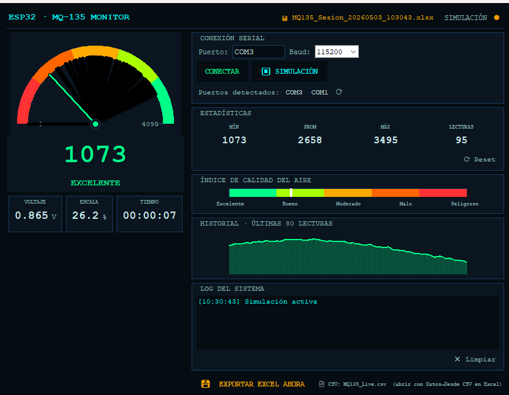
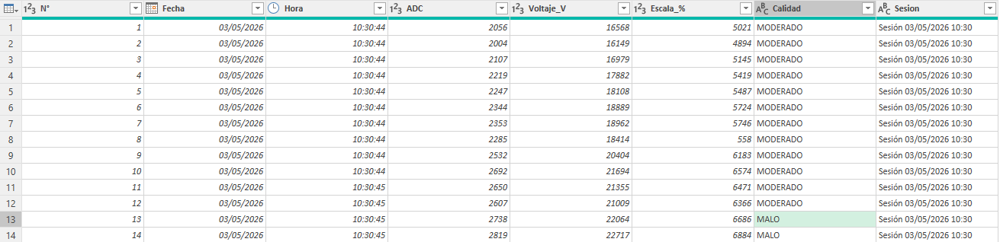
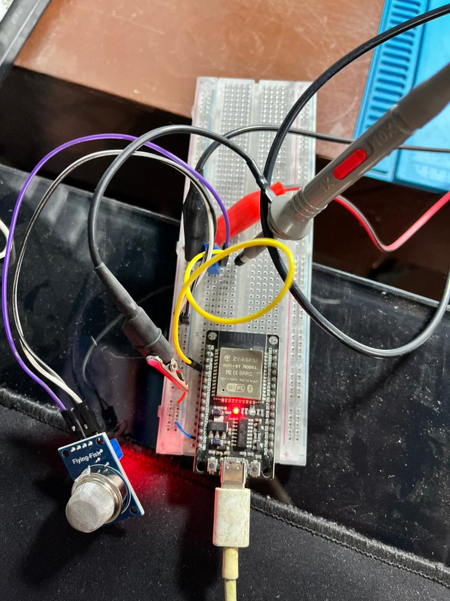
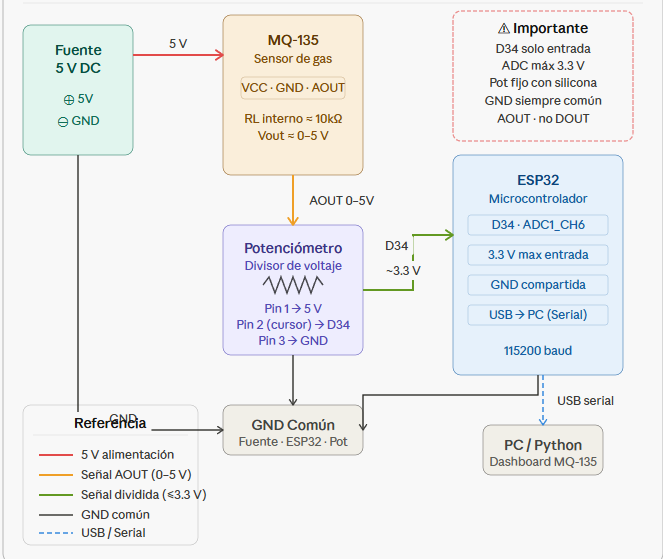

# 🌫️ Sistema de Adquisición de Datos de Calidad del Aire — ESP32 + MQ-135

<div align="center">


**Adquisición, visualización y almacenamiento en tiempo real de calidad del aire**  
mediante sensor electroquímico MQ-135 y microcontrolador ESP32

| 👤 Autores | 🏫 Institución | 📅  |
|---|---|---|
| Miguel Angel Cuervo Cuervo | ECCI — Ingeniería en Electrónica | 2026 |


</div>

---

## 📋 Tabla de Contenido

- [Descripción General](#-descripción-general)
- [Arquitectura del Sistema](#-arquitectura-del-sistema)
- [Hardware Utilizado](#-hardware-utilizado)
  - [ESP32 DOIT DevKit V1](#esp32-doit-devkit-v1)
  - [Sensor MQ-135](#sensor-mq-135)
  - [Divisor de Tensión](#divisor-de-tensión-protección-del-adc)
  - [Conexiones y Esquemático](#conexiones-y-esquemático)
- [Estructura del Proyecto](#-estructura-del-proyecto)
- [Entorno de Desarrollo](#-entorno-de-desarrollo)
- [Archivos de Configuración](#-archivos-de-configuración)
  - [platformio.ini](#1-platformioini)
  - [Tabla de Particiones CSV](#2-partitions_singleapp_2mbcsv)
  - [CMakeLists.txt (src)](#3-srccmakeliststxt)
  - [CMakeLists.txt (raíz)](#4-cmakeliststxt-raíz)
- [Firmware ESP32 — main.c](#-firmware-esp32--mainc)
- [Dashboard Python](#-dashboard-python--mq135_dashboardpy)
  - [Bloque 1: Importaciones y Constantes](#bloque-1-importaciones-constantes-y-paleta)
  - [Bloque 2: Logger CSV](#bloque-2-csvlogger)
  - [Bloque 3: Logger Excel](#bloque-3-excellogger)
  - [Bloque 4: Widgets Canvas](#bloque-4-widgets-canvas)
  - [Bloque 5: Hilos de Adquisición](#bloque-5-hilos-de-adquisición)
  - [Bloque 6: Ventana Principal y Bucle](#bloque-6-ventana-principal-app)
  - [Bloque 7: Punto de Entrada](#bloque-7-punto-de-entrada)
- [Instalación y Ejecución](#-instalación-y-ejecución)
- [Resultados](#-resultados)
- [Interpretación de Valores](#-interpretación-de-valores-adc)
- [Errores Comunes y Soluciones](#-errores-comunes-y-soluciones)
- [Referencias](#-referencias)

---

## 📌 Descripción General

Este proyecto implementa un **sistema completo de adquisición de datos de calidad del aire** con los siguientes componentes:

- **Nodo sensor**: ESP32 DOIT DevKit V1 leyendo el sensor MQ-135 cada 100 ms mediante la API `adc_oneshot` de ESP-IDF v5.x.
- **Protocolo de comunicación**: UART a 115 200 baud vía USB hacia el PC.
- **Dashboard PC**: Script Python con Tkinter que muestra un manómetro animado, historial de forma de onda, barra de calidad del aire e indicadores estadísticos en tiempo real.
- **Almacenamiento**: Cada muestra se guarda en un CSV en tiempo real; el promedio de cada ventana de 10 segundos se exporta a un archivo Excel `.xlsx` con formato profesional y tres hojas (Lecturas, Estadísticas, Info).

### Flujo de datos

```
[MQ-135] ──AO──► [Potenciómetro] ──~3.3V──► [GPIO 34 / ADC1_CH6]
                                                      │
                                               [ESP32 ESP-IDF]
                                                      │
                                             printf("%d\n", adc_raw)
                                                      │
                                              [USB Serial 115200]
                                                      │
                                           [Python Dashboard PC]
                                            ┌──────────────────┐
                                            │  Manómetro        │
                                            │  Forma de onda    │
                                            │  Barra calidad    │
                                            │  CSV en tiempo real│
                                            │  Excel cada 10 s  │
                                            └──────────────────┘
```

---

## 🏗️ Arquitectura del Sistema

El sistema sigue una arquitectura de **tres capas** claramente separadas:

| Capa | Componente | Tecnología |
|------|-----------|-----------|
| **Adquisición** | ESP32 lee el ADC cada 100 ms | C / ESP-IDF v5.x |
| **Transporte** | Puerto serial USB-UART | CH340 @ 115 200 baud |
| **Presentación** | Dashboard con manómetro + registros | Python 3 / Tkinter / openpyxl |

En el lado Python, el software sigue internamente tres subcapas:

1. **Hilo `SerialReader`** — lee líneas del COM en un thread dedicado y las deposita en una `collections.deque` thread-safe.
2. **Bucle `root.after(50 ms)`** — consume la cola, actualiza estadísticas y gestiona la ventana de promediado de 10 s para Excel.
3. **Widgets Canvas** — `Manometer`, `WaveCanvas` y `AirBar` se redibujan con cada nuevo valor.

---

## 🔧 Hardware Utilizado

### ESP32 DOIT DevKit V1

| Parámetro | Valor |
|-----------|-------|
| Modelo de chip | ESP32-D0WD-V3 |
| Revisión de silicio | v3.1 |
| Arquitectura | Xtensa Dual-Core LX6 |
| Frecuencia de CPU | 240 MHz |
| RAM interna | 320 KB |
| Flash | 2 MB (SPI, modo DIO) |
| Chip USB-Serial | CH340 |
| ADC | 12 bits, 18 canales |
| Voltaje lógico | 3.3 V |
| Formato | DevKit V1 — 30 pines |

> **Cómo identificar tu ESP32:** Conecta la placa y abre [web.esphome.io](https://web.esphome.io) en Chrome. Conecta, presiona Reset y lee la línea `Chip is ESP32-D0WD-V3 (revision v3.1)` en el log de arranque.

### Sensor MQ-135

| Parámetro | Valor |
|-----------|-------|
| Voltaje de circuito (Vc) | 5 V ± 0.1 V |
| Voltaje de calentamiento (Vh) | 5 V ± 0.1 V |
| Potencia de calentamiento (Ph) | < 800 mW |
| Resistencia de carga (RL) | 10 kΩ |
| Salida analógica (Vout) | 0 – 5 V |
| Gases detectables | NH₃, NOₓ, CO₂, benceno, humo, alcohol |
| Tiempo de precalentamiento | > 24 h (para medidas estables) |

El módulo comercial **Flying-Fish MQ-135** incluye un comparador LM393 que genera la salida digital **DO**. En este proyecto se usa **exclusivamente la salida analógica AO**.

> ⚠️ **Importante:** El sensor se calienta durante el funcionamiento. Es completamente normal — el filamento interno a ~5 V es el responsable de la sensibilidad al gas.

### Divisor de Tensión — Protección del ADC

Como la salida AO del MQ-135 puede llegar a 5 V y el ADC del ESP32 admite **máximo 3.3 V**, es obligatorio reducir el voltaje antes de conectar al GPIO 34.

Se usó un **potenciómetro de 10 kΩ** configurado como divisor ajustable:

```
AO del MQ-135 (0–5 V)
       │
   [Pin 1 POT]
       │
   ╔══╧══╗
   ║  R1  ║  ← parte superior del potenciómetro
   ╟──────╢
   ║      ╟──────────────► GPIO 34 del ESP32 (~3.25 V máx)
   ║  R2  ║  ← parte inferior del potenciómetro
   ╚══╤══╝
       │
   [Pin 3 POT]
       │
      GND ◄──────────────── GND del ESP32
                  ▲
          GND del MQ-135
                  ▲
          GND de la Fuente 5V
```

La fórmula del divisor es:

$$V_{out} = V_{in} \cdot \frac{R_2}{R_1 + R_2}$$

Se ajustó el potenciómetro hasta obtener **≈ 3.25 V** en el cursor con la salida máxima del sensor.

> 🚨 **Regla de oro:** Las tierras (GND) de la fuente 5 V, el sensor MQ-135 y el ESP32 **deben estar unidas en un nodo común**. Sin este nodo compartido, las lecturas del ADC serán completamente erróneas.

### Conexiones y Esquemático

| Pin MQ-135 | Conectar a |
|-----------|-----------|
| VCC | Fuente externa 5 V (+) |
| GND | GND común (fuente + ESP32) |
| AO | Pin 1 del potenciómetro |
| DO | No conectado (no se usa) |

| Pin Potenciómetro | Conectar a |
|-------------------|-----------|
| Pin 1 | AO del MQ-135 |
| Pin 2 (cursor) | GPIO 34 del ESP32 |
| Pin 3 | GND común |

| Pin ESP32 | Función |
|-----------|---------|
| GPIO 34 | Entrada analógica (ADC1_CH6) — desde cursor del POT |
| GND | Nodo GND común |
| USB | Alimentación + comunicación con PC |

> **Ubicación de GPIO 34 en la placa de 30 pines:** Es el **cuarto pin contando desde arriba** en el lado izquierdo, debajo de VP (GPIO 36) y VN (GPIO 39). Etiquetado como `D34` en la serigrafía.

---

## 📁 Estructura del Proyecto

```
ESP_32_MQ135_ADQUISCION/
│
├── platformio.ini                   # Configuración del entorno PlatformIO
├── partitions_singleapp_2MB.csv     # Tabla de particiones para flash de 2 MB
├── CMakeLists.txt                   # CMake raíz del proyecto ESP-IDF
│
├── src/
│   ├── CMakeLists.txt               # CMake del componente (incluye esp_adc)
│   └── main.c                       # Firmware principal del ESP32
│
├── mq135_dashboard.py               # Dashboard completo en Python
│
└── README.md                        # Este archivo
```

---

## 🛠️ Entorno de Desarrollo

| Herramienta | Versión / Detalle |
|------------|------------------|
| VS Code | Cualquier versión reciente |
| PlatformIO IDE | Extensión de VS Code |
| platform espressif32 | 7.0.0 |
| framework-espidf | 6.0.0 (ESP-IDF v5.x) |
| Python | 3.x (el interno de PlatformIO funciona) |
| pyserial | 3.5+ |
| openpyxl | Última versión |

### Framework ESP-IDF vs Arduino

Se eligió **ESP-IDF v5.x** en lugar de Arduino por:

- ✅ Acceso directo a periféricos hardware (ADC, GPIO, SPI) mediante APIs C nativas.
- ✅ Control explícito del planificador **FreeRTOS**, memoria y temporizadores.
- ✅ La nueva API `adc_oneshot` (v5) ofrece mayor precisión y tipado más seguro que la API legada `driver/adc.h`.
- ✅ `vTaskDelay()` cede el CPU al RTOS durante la espera — más eficiente que un bucle vacío.

---

## ⚙️ Archivos de Configuración

### 1. `platformio.ini`

```ini
[env:esp32doit-devkit-v1]
platform     = espressif32
board        = esp32doit-devkit-v1
framework    = espidf
monitor_speed = 115200
; Ajuste para flash real de 2 MB (evita warning de mismatch)
board_upload.flash_size = 2MB
```

| Parámetro | Por qué es importante |
|-----------|----------------------|
| `board = esp32doit-devkit-v1` | Define correctamente los pines para la placa DOIT con CH340 |
| `framework = espidf` | Activa el framework profesional de Espressif |
| `monitor_speed = 115200` | Alinea el monitor serie con la velocidad del bootloader |
| `board_upload.flash_size = 2MB` | Corrige la discrepancia entre flash real (2 MB) y el valor de la definición de placa (4 MB) |

---

### 2. `partitions_singleapp_2MB.csv`

```csv
# Name,   Type, SubType, Offset,  Size,     Flags
nvs,      data, nvs,     ,        0x6000,
phy_init, data, phy,     ,        0x1000,
factory,  app,  factory, ,        0x1E0000,
```

Este archivo es necesario cuando se especifica `board_upload.flash_size = 2MB`. Sin él, PlatformIO lanza el error `Missing partition table file`. Asigna el espacio de 2 MB en tres regiones:

| Región | Función |
|--------|---------|
| `nvs` | Almacenamiento no volátil (configuración Wi-Fi, parámetros) |
| `phy_init` | Datos de calibración de la radio RF |
| `factory` | La aplicación principal compilada |

---

### 3. `src/CMakeLists.txt`

```cmake
# Recopila todos los archivos fuente en src/
FILE(GLOB_RECURSE app_sources ${CMAKE_SOURCE_DIR}/src/*.*)

# Registra el componente e incluye el driver de ADC de ESP-IDF v5
idf_component_register(
    SRCS ${app_sources}
    PRIV_REQUIRES esp_adc
)
```

> ⚠️ La directiva `PRIV_REQUIRES esp_adc` es **crítica** en ESP-IDF v5. El componente ADC ya no se vincula automáticamente — debe declararse explícitamente. Sin esta línea obtendrás el error: `fatal error: esp_adc/adc_oneshot.h: No such file or directory`

---

### 4. `CMakeLists.txt` (raíz)

```cmake
cmake_minimum_required(VERSION 3.16.0)
include($ENV{IDF_PATH}/tools/cmake/project.cmake)
project(Adquisicion_de_datos_Esp32_MQ135)
```

Punto de entrada del sistema CMake de ESP-IDF. Define el nombre del proyecto y carga el sistema de build del framework.

---

## 💾 Firmware ESP32 — `main.c`

### ¿Por qué GPIO 34?

- Es un pin de **solo entrada** (*input-only*) — sin circuitos de salida que interfieran con la lectura analógica.
- **Sin resistencias internas** de pull-up/pull-down — mínimo error sistemático.
- Pertenece al **ADC1** que puede operar simultáneamente con el Wi-Fi (el ADC2 no puede).
- Internamente es el canal `ADC1_CHANNEL_6`.

### ¿Por qué `ADC_ATTEN_DB_12`?

La atenuación de 12 dB amplía el rango de lectura del ADC desde los 1.1 V predeterminados hasta **≈ 3.1 V**, cubriendo el voltaje máximo del divisor (3.25 V) con margen de seguridad.

### Código completo

```c
#include <stdio.h>
#include "freertos/FreeRTOS.h"
#include "freertos/task.h"
#include "esp_adc/adc_oneshot.h"   // API nueva de ESP-IDF v5.x

/* Canal del ADC para GPIO 34 (ADC1_CHANNEL_6) */
#define MQ135_CHANNEL ADC_CHANNEL_6

void app_main(void)
{
    /* ---- 1. Inicializar la unidad ADC1 ---- */
    adc_oneshot_unit_handle_t adc1_handle;
    adc_oneshot_unit_init_cfg_t init_config1 = {
        .unit_id = ADC_UNIT_1,
    };
    adc_oneshot_new_unit(&init_config1, &adc1_handle);

    /* ---- 2. Configurar el canal del MQ-135 ---- */
    adc_oneshot_chan_cfg_t config = {
        .bitwidth = ADC_BITWIDTH_DEFAULT,  // 12 bits → valores 0-4095
        .atten    = ADC_ATTEN_DB_12,       // rango hasta ~3.1 V
    };
    adc_oneshot_config_channel(adc1_handle, MQ135_CHANNEL, &config);

    printf("Iniciando lectura MQ-135 en GPIO 34...\n");

    while (1) {
        int adc_raw = 0;

        /* Leer la muestra cruda del ADC */
        adc_oneshot_read(adc1_handle, MQ135_CHANNEL, &adc_raw);

        /*
         * Se imprime SOLO el número (sin texto adicional)
         * para que Python pueda parsearlo directamente con int().
         */
        printf("%d\n", adc_raw);

        /* 100 ms entre muestras → aguja fluida en Python */
        vTaskDelay(pdMS_TO_TICKS(100));
    }
}
```

### Explicación línea a línea

| Líneas | Qué hace |
|--------|---------|
| `#include "esp_adc/adc_oneshot.h"` | Cabecera de la API nueva de ADC (ESP-IDF v5). Reemplaza a la deprecada `driver/adc.h` |
| `#define MQ135_CHANNEL ADC_CHANNEL_6` | Mapea GPIO 34 → canal 6 del ADC1 |
| `adc_oneshot_new_unit()` | Inicializa el handle de la unidad ADC1. Usa *designated initializers* de C99 |
| `.atten = ADC_ATTEN_DB_12` | Amplía el rango de entrada de 1.1 V a ~3.1 V |
| `adc_oneshot_read()` | Bloquea hasta que la conversión ADC finaliza; deposita el resultado (0–4095) en `adc_raw` |
| `printf("%d\n", adc_raw)` | Envía **solo el número** por UART. El script Python ejecutará `int(line)` sin parsing adicional |
| `vTaskDelay(pdMS_TO_TICKS(100))` | Pausa de 100 ms cediendo el CPU al planificador FreeRTOS — correcto en ESP-IDF, nunca usar `delay()` de Arduino |

---

## 🐍 Dashboard Python — `mq135_dashboard.py`

### Bloque 1: Importaciones, Constantes y Paleta

```python
import tkinter as tk
from tkinter import ttk
import math, serial, serial.tools.list_ports
import threading, time, collections
import random, os, csv, datetime, tempfile
from openpyxl import Workbook
from openpyxl.styles import (Font, PatternFill,
    Alignment, Border, Side)
from openpyxl.utils import get_column_letter

# ── Configuración del puerto y ADC ──────────────────────
DEFAULT_PORT     = "COM3"    # Cambiar según tu sistema
DEFAULT_BAUD     = 115200
ADC_MAX          = 4095      # Resolución 12 bits
VREF             = 3.3       # Voltaje de referencia (V)
HISTORY_LEN      = 80        # Muestras en el historial
UPDATE_MS        = 50        # Refresco de la GUI (ms)
CSV_UPDATE_EVERY = 10        # Flush del buffer CSV cada N lecturas

# ── Umbrales de calidad del aire ─────────────────────────
AIR_QUALITY = [
    (0,    1200, "EXCELENTE", "#00ff88"),
    (1200, 2000, "BUENO",     "#aaff00"),
    (2000, 2700, "MODERADO",  "#ff9900"),
    (2700, 3400, "MALO",      "#ff6600"),
    (3400, 4095, "PELIGROSO", "#ff3333"),
]

# ── Paleta dark HUD ──────────────────────────────────────
C = {
    "bg":     "#050c12",   # Fondo principal
    "panel":  "#0a1520",   # Fondo de paneles
    "border": "#1a3a5a",   # Bordes
    "text":   "#8bbbbb",   # Texto secundario
    "bright": "#cceeee",   # Texto principal
    "hud":    "#00ffff",   # Acento cian
    "ok":     "#00ff88",   # Verde (EXCELENTE)
    "warn":   "#ff9900",   # Naranja (MODERADO)
    "danger": "#ff3333",   # Rojo (PELIGROSO)
    "amber":  "#ffaa00",   # Amarillo (indicadores)
}
```

---

### Bloque 2: `CsvLogger`

Registra **cada muestra individual** en tiempo real con buffer para no bloquear la GUI.

```python
class CsvLogger:
    HEADERS = ["N", "Fecha", "Hora", "ADC",
               "Voltaje_V", "Escala_%", "Calidad", "Sesion"]

    def __init__(self, filepath):
        self.filepath = filepath
        self._lock    = threading.Lock()
        self._count   = 0
        self._buffer  = []
        # Crear archivo con cabecera
        with open(filepath, "w", newline="",
                  encoding="utf-8-sig") as f:
            csv.writer(f).writerow(self.HEADERS)

    def log(self, val, label, session_name):
        dt      = datetime.datetime.now()
        voltage = round(val * VREF / ADC_MAX, 4)
        pct     = round(val / ADC_MAX * 100, 2)
        row = [
            self._count + 1,
            dt.strftime("%Y-%m-%d"),
            dt.strftime("%H:%M:%S.") + f"{dt.microsecond // 1000:03d}",
            val, voltage, pct, label, session_name
        ]
        with self._lock:
            self._count += 1
            self._buffer.append(row)
            # Vaciar al disco cada CSV_UPDATE_EVERY lecturas
            if self._count % CSV_UPDATE_EVERY == 0:
                self._flush()

    def _flush(self):
        with open(self.filepath, "a", newline="",
                  encoding="utf-8-sig") as f:
            w = csv.writer(f)
            for r in self._buffer:
                w.writerow(r)
        self._buffer.clear()

    def close(self):
        with self._lock:
            self._flush()
```

---

### Bloque 3: `ExcelLogger`

Guarda el **promedio de cada ventana de 10 segundos** en un `.xlsx` con formato profesional. El guardado es **atómico** (usa archivo temporal) para evitar corrupción si se cierra la app inesperadamente.

```python
class ExcelLogger:
    COLOR_HEADER_BG = "0D1F2D"
    COLOR_HEADER_FG = "00FFFF"
    CALIDAD_COLORS  = {
        "EXCELENTE": "00C86A", "BUENO":    "88CC00",
        "MODERADO":  "FF8800", "MALO":     "FF5500",
        "PELIGROSO": "FF2222",
    }

    def __init__(self, filepath, logger_callback=None):
        self.filepath = filepath
        self.wb       = Workbook()
        self._row     = 2
        self._count   = 0
        self._lock    = threading.Lock()

        # Tres hojas del libro
        self.ws_data  = self.wb.active
        self.ws_data.title = "Lecturas"
        self.ws_stats = self.wb.create_sheet("Estadisticas")
        self.ws_info  = self.wb.create_sheet("Info")

        self._setup_data_sheet()
        self._setup_stats_sheet()
        self._setup_info_sheet()
        self._save(initial=True)

    def log(self, val, label, session_name):
        """Escribe una fila de promedio en la hoja Lecturas."""
        with self._lock:
            self._count += 1
            dt = datetime.datetime.now()
            voltage = round(val * VREF / ADC_MAX, 4)
            pct     = round(val / ADC_MAX * 100, 2)
            # ... (escritura de la fila con estilos)

    def _save(self, initial=False):
        """Guardado atómico: escribe en tmp y luego reemplaza."""
        with self._lock:
            dir_name = os.path.dirname(self.filepath)
            try:
                with tempfile.NamedTemporaryFile(
                    dir=dir_name, prefix="~$",
                    suffix=".xlsx", delete=False
                ) as tmp:
                    tmp_name = tmp.name
                self.wb.save(tmp_name)
                if os.path.exists(self.filepath):
                    os.replace(tmp_name, self.filepath)
                else:
                    os.rename(tmp_name, self.filepath)
                return True
            except Exception as e:
                print(f"Error al guardar Excel: {e}")
                return False

    def close(self):
        self._save()

    def export_now(self, dest_path):
        """Exporta una copia inmediata a dest_path."""
        with self._lock:
            try:
                dir_name = os.path.dirname(dest_path)
                with tempfile.NamedTemporaryFile(
                    dir=dir_name, prefix="~$",
                    suffix=".xlsx", delete=False
                ) as tmp:
                    tmp_name = tmp.name
                self.wb.save(tmp_name)
                os.replace(tmp_name, dest_path)
                return True
            except Exception as e:
                print(f"Error al exportar: {e}")
                return False
```

---

### Bloque 4: Widgets Canvas

#### `Manometer` — manómetro con aguja trigonométrica

El ángulo de la aguja se calcula así:

$$\theta = 180° - \frac{V_{ADC}}{4095} \times 180°$$

Las coordenadas del extremo de la aguja:

$$x = x_c + r \cdot \cos(\theta) \qquad y = y_c - r \cdot \sin(\theta)$$

```python
class Manometer(tk.Canvas):
    def __init__(self, parent, size=260, **kw):
        super().__init__(
            parent, width=size,
            height=size // 2 + 30,
            bg=C["panel"], highlightthickness=0, **kw)
        self.cx    = size // 2
        self.cy    = size // 2 + 10
        self.r_arc = size // 2 - 20
        self._needle_id = None
        self._hub_id    = None
        self._draw_static()
        self._draw_needle(180.0, C["hud"])

    def _draw_static(self):
        """Dibuja el arco con las 5 zonas de color."""
        cx, cy, r = self.cx, self.cy, self.r_arc
        colors = ["#00ff88", "#aaff00", "#ffaa00",
                  "#ff6600", "#ff3333"]
        seg = 180 / len(colors)
        for i, col in enumerate(colors):
            self.create_arc(
                cx-r, cy-r, cx+r, cy+r,
                start=i*seg, extent=seg,
                style=tk.ARC, outline=col, width=18)

    def _draw_needle(self, angle_deg, color):
        """Calcula y dibuja la aguja usando seno/coseno."""
        cx, cy = self.cx, self.cy
        if self._needle_id:
            self.delete(self._needle_id)
        if self._hub_id:
            self.delete(self._hub_id)
        rad = math.radians(angle_deg)
        tx  = cx + (self.r_arc - 10) * math.cos(rad)
        ty  = cy - (self.r_arc - 10) * math.sin(rad)
        self._needle_id = self.create_line(
            cx, cy, tx, ty,
            fill=color, width=3, capstyle=tk.ROUND)
        r_hub = 8
        self._hub_id = self.create_oval(
            cx-r_hub, cy-r_hub, cx+r_hub, cy+r_hub,
            fill=C["panel"], outline=C["border"])

    def set_value(self, val):
        angle = 180.0 - (val / ADC_MAX * 180.0)
        _, col = classify(val)
        self._draw_needle(angle, col)
```

#### `WaveCanvas` — historial de forma de onda

```python
class WaveCanvas(tk.Canvas):
    """Muestra las últimas HISTORY_LEN muestras como señal continua."""
    def __init__(self, parent, width=560, height=70, **kw):
        super().__init__(parent, width=width, height=height,
                         bg=C["panel"], highlightthickness=0, **kw)
        self.w    = width
        self.h    = height
        self._buf = collections.deque(maxlen=HISTORY_LEN)

    def push(self, val):
        self._buf.append(val)
        self._redraw()

    def _redraw(self):
        self.delete("all")
        buf = list(self._buf)
        if len(buf) < 2:
            return
        _, col = classify(buf[-1])
        pts = []
        for i, v in enumerate(buf):
            x = i / (HISTORY_LEN - 1) * self.w
            y = self.h - (v / ADC_MAX) * (self.h - 4) - 2
            pts.append((x, y))
        flat = [c for p in pts for c in p]
        self.create_line(*flat, fill=col,
                         width=1.5, smooth=True)
```

#### `AirBar` — barra de calidad del aire con cursor

```python
class AirBar(tk.Canvas):
    """Barra horizontal cromática con cursor de posición."""
    def __init__(self, parent, width=560, height=14, **kw):
        super().__init__(parent, width=width, height=height,
                         bg=C["panel"], highlightthickness=0, **kw)
        self.w       = width
        self.h       = height
        self._needle = None
        colors  = ["#00ff88", "#aaff00", "#ffaa00",
                   "#ff6600", "#ff3333"]
        seg_w = width / len(colors)
        for i, c in enumerate(colors):
            self.create_rectangle(
                i*seg_w, 0, (i+1)*seg_w, height,
                fill=c, outline="")

    def set_value(self, val):
        if self._needle:
            self.delete(self._needle)
        x = val / ADC_MAX * self.w
        self._needle = self.create_rectangle(
            x-2, -2, x+2, self.h+2,
            fill="white", outline="")
```

---

### Bloque 5: Hilos de Adquisición

```python
class SerialReader(threading.Thread):
    """Lee el ESP32 por puerto COM en un hilo dedicado (daemon)."""
    def __init__(self, port, baud, callback_data, callback_err):
        super().__init__(daemon=True)
        self.port     = port
        self.baud     = baud
        self.on_data  = callback_data
        self.on_err   = callback_err
        self._running = True
        self._ser     = None

    def run(self):
        try:
            self._ser = serial.Serial(
                self.port, self.baud, timeout=1)
            self._ser.flushInput()
            while self._running:
                if self._ser.in_waiting > 0:
                    try:
                        raw = self._ser.readline()
                        raw = raw.decode("utf-8",
                                         errors="ignore").strip()
                        if raw:
                            self.on_data(int(float(raw)))
                    except ValueError:
                        pass
                time.sleep(0.01)
        except Exception as e:
            self.on_err(str(e))

    def stop(self):
        self._running = False
        if self._ser and self._ser.is_open:
            self._ser.close()


class SimReader(threading.Thread):
    """Genera datos sinusoidales con ruido gaussiano para pruebas sin hardware."""
    def __init__(self, callback_data):
        super().__init__(daemon=True)
        self.on_data  = callback_data
        self._running = True
        self._phase   = 0.0

    def run(self):
        while self._running:
            self._phase += 0.04
            val = int(2000
                      + math.sin(self._phase) * 1400
                      + random.gauss(0, 60))
            val = max(0, min(ADC_MAX, val))
            self.on_data(val)
            time.sleep(0.08)

    def stop(self):
        self._running = False
```

---

### Bloque 6: Ventana Principal `App`

```python
class App(tk.Tk):
    def __init__(self):
        super().__init__()
        self.title("ESP32 - MQ-135 Dashboard")
        self.configure(bg=C["bg"])
        self.resizable(False, False)

        # Ventana de 10 s para el promedio del Excel
        self._window_period = 10.0
        self._window_start  = time.time()
        self._window_vals   = []

        # Inicializar loggers
        ts = datetime.datetime.now().strftime("%Y%m%d_%H%M%S")
        excel_path = f"MQ135_Sesion_{ts}.xlsx"
        self._session_name = (
            f"Sesion "
            f"{datetime.datetime.now().strftime('%d/%m/%Y %H:%M')}")
        self._excel = ExcelLogger(excel_path)
        self._csv   = CsvLogger("MQ135_Live.csv")

        self._reader  = None
        self._sim     = None
        self._running = False
        self._sim_on  = False
        self._stats   = {"min": None, "max": None,
                          "sum": 0, "n": 0}
        self._data_q  = collections.deque()

        self._build_ui()
        self._start_sim()          # Arranca en modo simulación
        self._schedule_update()

    def _schedule_update(self):
        """Bucle principal: refresca la GUI cada UPDATE_MS ms."""
        self._process_queue()
        self.after(UPDATE_MS, self._schedule_update)

    def _process_queue(self):
        """Consume todos los valores pendientes en la cola."""
        batch = []
        while self._data_q:
            batch.append(self._data_q.popleft())

        if not batch:
            self._check_excel_window()
            return

        for val in batch:
            val = max(0, min(ADC_MAX, val))
            # Actualizar estadísticas globales
            s = self._stats
            if s["min"] is None or val < s["min"]:
                s["min"] = val
            if s["max"] is None or val > s["max"]:
                s["max"] = val
            s["sum"] += val
            s["n"]   += 1
            # Acumular para promedio Excel
            self._window_vals.append(val)
            # Guardar en CSV (tiempo real)
            label, _ = classify(val)
            self._csv.log(val, label, self._session_name)

        # Actualizar la interfaz con el último valor
        self._update_display(batch[-1])
        self._check_excel_window()

    def _check_excel_window(self):
        """Cuando se cumplen 10 s, calcula el promedio y lo guarda en Excel."""
        now = time.time()
        if now - self._window_start >= self._window_period:
            if self._window_vals:
                avg = round(sum(self._window_vals) /
                            len(self._window_vals))
                label, _ = classify(avg)
                threading.Thread(
                    target=self._excel.log,
                    args=(avg, label, self._session_name),
                    daemon=True
                ).start()
            self._window_start = now
            self._window_vals.clear()

    def on_close(self):
        """Guarda datos pendientes antes de cerrar."""
        if self._window_vals:
            avg = round(sum(self._window_vals) /
                        len(self._window_vals))
            label, _ = classify(avg)
            self._excel.log(avg, label, self._session_name)
        self._excel.close()
        self._csv.close()
        self.destroy()
```

---

### Bloque 7: Punto de Entrada

```python
def classify(val):
    """Devuelve (etiqueta, color_hex) según el valor ADC."""
    for lo, hi, label, color in AIR_QUALITY:
        if lo <= val <= hi:
            return label, color
    return "DESCONOCIDO", C["text"]

if __name__ == "__main__":
    app = App()
    app.protocol("WM_DELETE_WINDOW", app.on_close)
    app.mainloop()
```

---

## 🚀 Instalación y Ejecución

### Paso 1 — Clonar el repositorio

```bash
git clone https://github.com/tu-usuario/ESP_32_MQ135_ADQUISCION.git
cd ESP_32_MQ135_ADQUISCION
```

### Paso 2 — Instalar dependencias Python

Si tienes Python en el PATH:
```bash
pip install pyserial openpyxl
```

Si usas el Python interno de PlatformIO (Windows PowerShell):
```powershell
& "C:\Users\TU_USUARIO\.platformio\penv\Scripts\python.exe" -m pip install pyserial openpyxl
```

### Paso 3 — Compilar y cargar el firmware

1. Abre VS Code con la extensión PlatformIO.
2. Abre la carpeta del proyecto.
3. Cierra el Monitor Serie si estaba abierto (ícono de basura en la terminal inferior).
4. Haz clic en la flecha **→ Upload** en la barra inferior.

Salida esperada al finalizar:
```
Chip is ESP32-D0WD-V3 (revision v3.1)
Wrote 143024 bytes at 0x00010000
Hash of data verified.
Hard resetting via RTS pin...
[SUCCESS] Took 16.12 seconds
```

### Paso 4 — Ejecutar el dashboard Python

1. Identifica el puerto COM de tu ESP32 en el Administrador de Dispositivos de Windows (aparece como `CH340`).
2. Edita `mq135_dashboard.py` y ajusta `DEFAULT_PORT = "COM3"` al puerto correcto.
3. **Cierra el Monitor Serie de PlatformIO** (el puerto no puede estar ocupado por dos procesos).
4. Ejecuta:

```bash
python mq135_dashboard.py
```

O con el Python de PlatformIO:
```powershell
& "C:\Users\TU_USUARIO\.platformio\penv\Scripts\python.exe" mq135_dashboard.py
```

---

## 📊 Resultados

### Dashboard en funcionamiento



El dashboard muestra en tiempo real:
- **Manómetro** con aguja animada y zonas de color verde → rojo.
- **Número ADC grande** (0–4095) con color según categoría.
- **Barra de calidad del aire** con cursor de posición.
- **Historial de forma de onda** de las últimas 80 muestras.
- **Estadísticas**: mínimo, promedio, máximo y contador de lecturas.
- **Log del sistema** con timestamps.

### Adquisición en Excel



Cada fila del Excel corresponde al promedio de una ventana de 10 segundos. Las columnas incluyen: N°, Fecha, Hora (con ms), ADC promedio, Voltaje (V), Escala (%), Calidad y nombre de Sesión.

### Montaje físico



Esquemático del circuito:



---

## 📈 Interpretación de Valores ADC

| Rango ADC | Voltaje aprox. | Calidad | Indicación |
|-----------|---------------|---------|-----------|
| 0 – 1 199 | 0.00 – 0.96 V | 🟢 **EXCELENTE** | Aire limpio, sin gases detectables |
| 1 200 – 1 999 | 0.97 – 1.61 V | 🟡 **BUENO** | Presencia leve de CO₂ ambiental |
| 2 000 – 2 699 | 1.61 – 2.17 V | 🟠 **MODERADO** | Concentración moderada de gases |
| 2 700 – 3 399 | 2.17 – 2.74 V | 🔴 **MALO** | Alta concentración — ventila el espacio |
| 3 400 – 4 095 | 2.74 – 3.30 V | ⛔ **PELIGROSO** | Presencia fuerte de gas — ¡alerta! |

> **Nota sobre calibración:** Los umbrales anteriores son cualitativos. Para obtener valores en ppm (partes por millón) de CO₂ o NH₃, se requiere calibración con gas patrón y aplicar la curva logarítmica Rs/R₀ del datasheet MQ-135.

---

## 🔧 Errores Comunes y Soluciones

| Error | Causa | Solución |
|-------|-------|---------|
| `driver/adc.h: No such file or directory` | Se usa la API legada de ESP-IDF v4 con framework v5 | Cambiar a `esp_adc/adc_oneshot.h` y añadir `PRIV_REQUIRES esp_adc` en CMakeLists.txt |
| `Could not open COM3 — PermissionError` | El Monitor Serie de PlatformIO tiene el puerto ocupado | Cerrar el monitor (ícono de basura) antes de hacer Upload o ejecutar Python |
| `Missing partition table file` | Se referencia un CSV de particiones que no existe | Crear el archivo `partitions_singleapp_2MB.csv` en la raíz del proyecto |
| `Flash memory size mismatch: Expected 4MB, found 2MB` | La definición de placa asume 4 MB pero la placa tiene 2 MB | Añadir `board_upload.flash_size = 2MB` en `platformio.ini` |
| `ModuleNotFoundError: No module named 'serial'` | `pyserial` no está instalado en el Python que se está usando | Instalar con el ejecutable correcto: `python.exe -m pip install pyserial` |
| ADC siempre en 0 | Potenciómetro ajustado demasiado bajo | Girar el potenciómetro hasta obtener ≥ 100 mV en GPIO 34 en aire limpio |
| ADC siempre en 4095 | Voltaje en GPIO 34 supera 3.1 V | Ajustar el potenciómetro para reducir el voltaje del cursor |
| Lecturas erráticas sin gas | GND no compartido entre fuente, sensor y ESP32 | Unir los tres GND en un nodo común |

---

## 📚 Referencias

1. Hanwei Electronics, "MQ-135 Gas Sensor Datasheet," Zhengzhou, China, 2013.
2. Espressif Systems, "ESP32 Technical Reference Manual," v5.3, Shanghai, 2023. [Online]: https://www.espressif.com/sites/default/files/documentation/esp32_technical_reference_manual_en.pdf
3. PlatformIO Labs, "PlatformIO IDE Documentation," 2024. [Online]: https://docs.platformio.org
4. Espressif Systems, "ESP-IDF Programming Guide — ADC Oneshot Mode," v5.x, 2024. [Online]: https://docs.espressif.com/projects/esp-idf/en/latest/esp32/api-reference/peripherals/adc_oneshot.html
5. Python Software Foundation, "tkinter — Python interface to Tcl/Tk," Python 3 Documentation. [Online]: https://docs.python.org/3/library/tkinter.html
6. C. Liechti, "pyserial — Python Serial Port Extension," 2024. [Online]: https://pyserial.readthedocs.io

---

<div align="center">

**ECCI — Escuela Colombiana de Carreras Industriales**  
Ingeniería en Electrónica  · 2026

Miguel Angel Cuervo Cuervo 

</div>